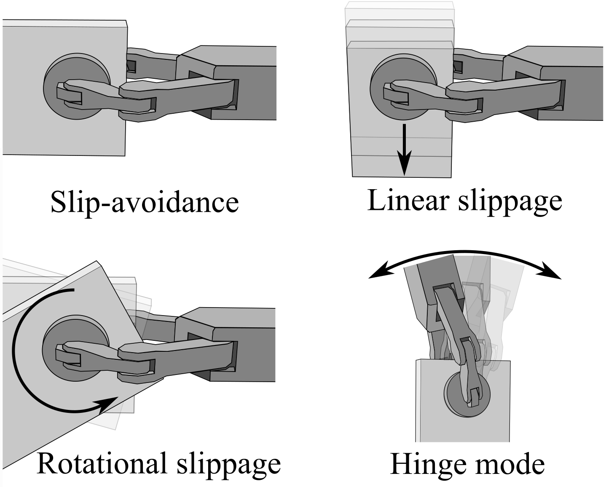

# Perception, Control and Hardware for In-Hand Slip-Aware Object Manipulation with Parallel Grippers

This repo proviedes the main repo and experimental data for the paper "Perception, Control and Hardware for In-Hand Slip-Aware Object Manipulation with Parallel Grippers", preprint available at: https://arxiv.org/abs/2410.19660. Everything is provided as is. 

I have decided to divide the project into 3 repos: 
* The main code and experimental data (this repo)
* Build guide and embedded code for the gripper, see TODO add link
* Build guide and embedded code for the velocity sensors, see TODO add link

Be aware that not all notations and naming is the same as in the paper, (naming could definitly be imporved in this repo). I run it on Ubuntu 20 with ROS noetic, there are also plans to migrate to ROS2.   

## Overview
This project is all about in-hand slip-aware control and perception. The idea is that a robot should be able to pickup a parallel object and without any prior informaiton such as weight or friction coefficients, and do in-hand sliding manipulation in a reliable way, both in rotation and linear slippage. This would allow the robot to re-position and re-orient the object within the gripper, by only leveraging gravity. See figure below, for the different in-hand slip-aware controllers implemented, the hardware is not limited to only gravity based in-hand manipulation, and future work will focus on extending the capabilities. It should be noted that as of writing this, there are plans to redesign the sensors, still based on similar principles. 



This repo is divided into sevral folders:
* src - Contains the code that is executed during experiments.
* plotting_gripper - Experimental data for the gripper performance and code for plotting the data.
* Plotting_UR10_experiments - code to analyse and plot experimental data from the slip experiments when the gipper is mounted on the UR10. 
* sensor_test - To calibrate the velocity sensors. 
* test_insturctions - Some notes on how to run the experiments. 
* UR_experiments - bag files from the experiments. 

## src
There is a gripper.launch file that launches the neccessary scripts for in-hand manipulation. Depending on what F/T sensors you use, you will have to update parts of the code to match. Here is a quick overview of the folder:
* calibrate_sensors.py - a script that was used to calibrate the velocity sensors. 
* close_loop_force_control.cpp - The grasp force controller (inner-loop in the paper), which takes F/T measurments and genrates a target force.
* controlled_slippage.py - Contains the slip-aware controllers. 
* friciton_estimation.py - Contains the code for friciton and contact radius estimation. 
* gripper_control_test.py - Testing of the gripper performance, first step response and then folloing sinusoidal curves. 
* gripper_control.py - Serial communication node with the gripper.
* start_ft_sensors.py - A small script to start the FT senor nodes.
* test_sensors.py - Script that was used to test the velocity sensors.  
* UR10_gripper.py - Interface that commands the different parts of the system, this is what I used as "user interface" during the experiments. It also sends commands to the UR10 robot.
* vel_sensors.py - Serial communication with the velocity sensors. 


## Useful commands 

## Run everything related to gripper

roslaunch gripper gripper.launch

## Gripper start things seperatly
Start the gripper communication 
```
rosrun gripper gripper_control.py
```

Start the FT sensors  
```
rosrun netft_utils netft_node --address=192.168.56.6 --sensor_nr=1
```
and
```
rosrun netft_utils netft_node --address=192.168.56.5 --sensor_nr=2
```

Start closed loop force control
```
rosrun gripper gripper_closed_loop_fc 
```

Call calibration service 

```
rosservice call /gripper_callibrate_ft 
```

## Calibrate vel sensors
Start the sensors
```
rosrun gripper vel_sensors.py
```

Run callibration script

```
rosrun gripper calibrate_sensors.py --sensor 2 --chip 3 --direction "y"
```

## Test vel sensors 
Start the sensors
```
rosrun gripper vel_sensors.py
```

```
rosrun gripper test_sensors.py --sensor 1 --direction "x"
```

## Friction estimation 
```
rosrun gripper friction_estimation.py
```
```
rosservice call /friction_estimation_mode
```

## Slippage control 
See /test_instructions or if you want to run the slip controllers without running UR10_gripper.py

Slip-avoidance
```
rosservice call /slippage_control {t=0,angle=0,dist=0,mode=4}
```
Hinge mode
```
rosservice call /slippage_control {t=0,angle=0,dist=0,mode=3}
```
Linear slippage (2 cm in 2 seconds), always in direction of gravity
```
rosservice call /slippage_control {t=2,angle=0,dist=0.02,mode=2}
```
Rotational Slippage (20 degrees in 2 seconds), always in direction of gravity
```
rosservice call /slippage_control {t=2,angle=20,dist=0.0,mode=1}
```
## UR10

see https://github.com/UniversalRobots/Universal_Robots_ROS_Driver
